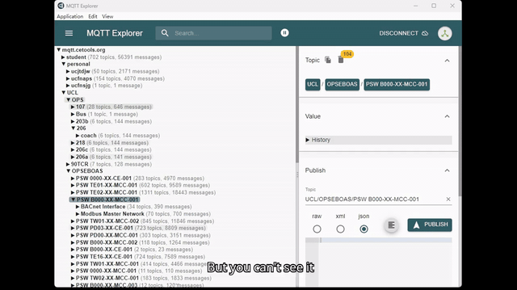

# Registration-Free Spatial AR Dashboard (RSAD)

**Registration-Free Spatial AR Dashboard for IoT-Rich Environments** — an MSc Connected Environments (UCL CASA0022) dissertation project by Yuqian Lin, supervised by Valerio Signorelli.

RSAD anchors live telemetry panels beside the physical devices that produce them, using a Meta Quest 3 headset — with **no pre-registration** of devices. Point at a device and pull the trigger: the system captures RGB-depth, segments the device, binds it to the correct network identity through a provenance-aware matching stage, and anchors a floating data panel that stays glued to the physical object as the operator moves.

## Demo

Full demo recording: [Video_compressed.mp4](Video_compressed.mp4)

## How it works

1. **Capture** — Quest 3 passthrough RGB + environment depth, aligned through the [quest3RGB-D-Align](https://github.com/iiishop/quest3RGB-D-Align) pipeline
2. **Segment** — SAM 2 prompted segmentation driven by the head-direction cursor (multi-point prompt, depth-consistency check)
3. **Discover** — MQTT, mDNS, SSDP/UPnP and Nmap evidence folded into a persistent identity registry
4. **Match** — a provenance-weighted pairing engine scores every candidate: stable identifiers (MAC/USN/serial) weigh most, behaviour-derived capabilities narrow candidates, editable MQTT labels count only as weak evidence
5. **Confirm & anchor** — ambiguous matches are returned as ranked candidates for user confirmation; accepted panels are anchored to world positions via the Spatial Anchor API

## Evaluation

- **234 broker-visible MQTT identities** on the study account as the discovery/ranking corpus
- **3 end-to-end in-lab bindings** (CE Lab television, Prusa printer smart plug, temperature/humidity device) — the correct identity was retrieved within the ranked candidate list in all three
- Eight-rule leave-one-rule-out replay over 21 registry-derived queries: capability, device-class and structured-vendor evidence had the largest measured effects on ranking

## Repo layout

- `backend/viewer/` — Python RGB-D viewer: depth alignment, cursor-to-prompt projection, SAM 2 segmentation, mask refinement
- `backend/quest3server/` — per-room REST/HTTP API (`/api/room/*`, pairing `/candidates|refresh|bind|unbind`, `/api/room/object/device/control`) + discovery-backed network-device UI
- `unity/Quest3Client/` — Quest 3 Unity client (capture + streaming)
- `docs/` — MVP scope, implementation plan, SDK references, design archive
- `Video_compressed.mp4` — full demo recording

## Related

- [quest3RGB-D-Align](https://github.com/iiishop/quest3RGB-D-Align) — standalone, reproducible Quest 3 RGB-depth alignment pipeline (raw-to-metric conversion, inverse reprojection, z-buffered projection), validated on 300 RGB-depth pairs
