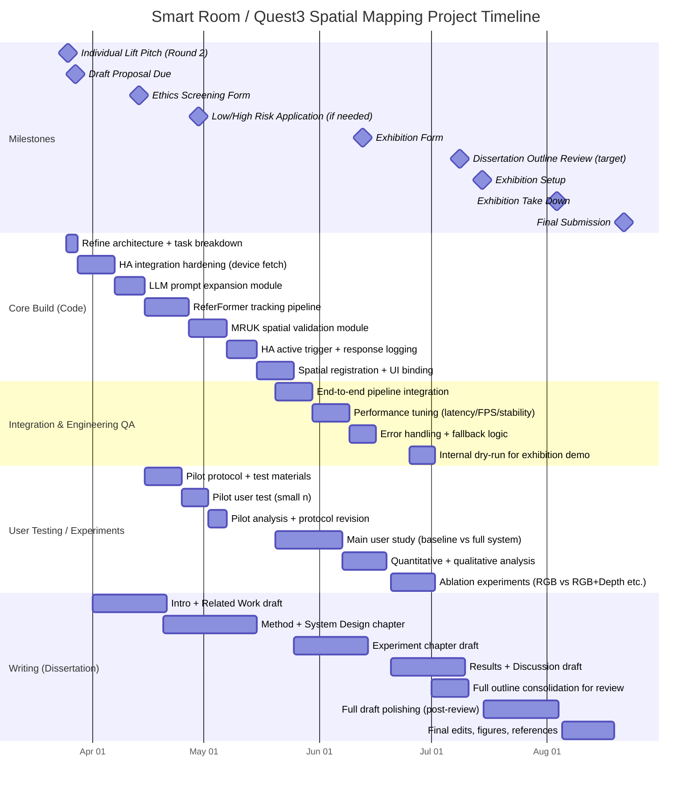

```mermaid
gantt
    title Smart Room / Quest3 Spatial Mapping Project Timeline
    dateFormat  YYYY-MM-DD
    axisFormat  %b %d
    section Milestones
    Individual Lift Pitch (Round 2)         :milestone, m1, 2026-03-25, 1d
    Draft Proposal Due                       :milestone, m2, 2026-03-27, 1d
    Ethics Screening Form                    :milestone, m3, 2026-04-13, 1d
    Low/High Risk Application (if needed)    :milestone, m4, 2026-04-29, 1d
    Exhibition Form                          :milestone, m5, 2026-06-12, 1d
    Dissertation Outline Review (target)     :milestone, m6, 2026-07-08, 1d
    Exhibition Setup                         :milestone, m7, 2026-07-13, 3d
    Exhibition Take Down                     :milestone, m8, 2026-08-03, 1d
    Final Submission                         :milestone, m9, 2026-08-21, 1d
    section Core Build (Code)
    Refine architecture + task breakdown     :a1, 2026-03-25, 3d
    HA integration hardening (device fetch)  :a2, after a1, 10d
    LLM prompt expansion module              :a3, after a2, 8d
    ReferFormer tracking pipeline            :a4, after a3, 12d
    MRUK spatial validation module           :a5, after a4, 10d
    HA active trigger + response logging     :a6, after a5, 8d
    Spatial registration + UI binding        :a7, after a6, 10d
    section Integration & Engineering QA
    End-to-end pipeline integration          :b1, 2026-05-20, 10d
    Performance tuning (latency/FPS/stability):b2, after b1, 10d
    Error handling + fallback logic          :b3, after b2, 7d
    Internal dry-run for exhibition demo     :b4, 2026-06-25, 7d
    section User Testing / Experiments
    Pilot protocol + test materials          :c1, 2026-04-15, 10d
    Pilot user test (small n)                :c2, after c1, 7d
    Pilot analysis + protocol revision       :c3, after c2, 5d
    Main user study (baseline vs full system):c4, 2026-05-20, 18d
    Quantitative + qualitative analysis      :c5, after c4, 12d
    Ablation experiments (RGB vs RGB+Depth etc.):c6, 2026-06-20, 12d
    section Writing (Dissertation)
    Intro + Related Work draft               :d1, 2026-04-01, 20d
    Method + System Design chapter           :d2, 2026-04-20, 25d
    Experiment chapter draft                 :d3, 2026-05-25, 20d
    Results + Discussion draft               :d4, 2026-06-20, 20d
    Full outline consolidation for review    :d5, 2026-07-01, 10d
    Full draft polishing (post-review)       :d6, 2026-07-15, 20d
    Final edits, figures, references         :d7, 2026-08-05, 14d
```