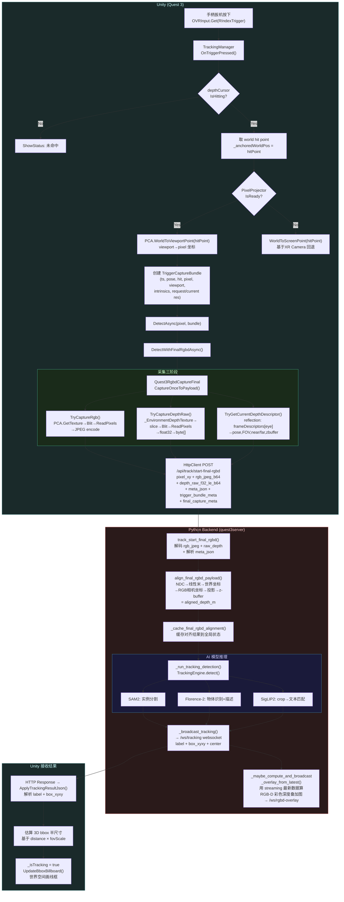
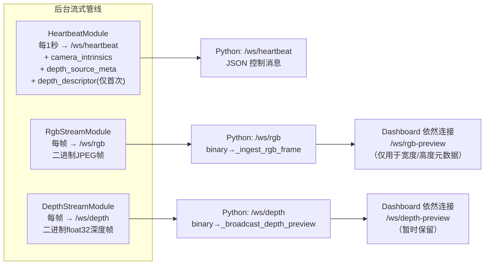

# Smart Room Unity → Backend 完整调用链分析

> 2026-06-17 · 盒马 · Smart Room 项目代码审计

---

## 一、项目脚本清单（36 个 C# 文件）

### 采集 Capture
| 文件 | 用途 | 状态 |
|------|------|------|
| `Quest3RgbdCaptureFinal.cs` | 最终 RGB-D 采集脚本（主流） | 🟢 生产 |
| `DepthDescriptorHelper.cs` | 反射提取深度描述符静态工具 | 🟢 生产 |
| `DepthPoseSaturationTest.cs` | 暴力反射探索脚本 | 🟡 仅用一次 |
| `RGBDCaptureTest.cs` | 旧版采集测试 | 🔴 已废弃 |

### 流式传输 Networking
| 文件 | 用途 | 状态 |
|------|------|------|
| `BackendCommunicationManager.cs` | WebSocket 管理中枢 | 🟢 生产 |
| `StreamTransportSwitcher.cs` | 传输模式切换（ADB/WiFi） | 🟢 生产 |
| `HeartbeatModule.cs` | 心跳 + 元数据推送 | 🟢 生产 |
| `RgbStreamModule.cs` | RGB 帧流式发送 | 🟢 生产 |
| `DepthStreamModule.cs` | 深度帧流式发送 + depth_descriptor | 🟢 生产 |
| `DepthFrameSampler.cs` | 深度帧采样辅助 | 🟢 生产 |
| `PixelProjector.cs` | 世界坐标→像素投影 | 🟢 生产 |
| `RaycastQueryModule.cs` | Raycast 查询 | 🟢 生产 |
| `DepthViewportRaycast.cs` | Viewport Raycast | 🟢 生产 |

### 交互 Interaction
| 文件 | 用途 | 状态 |
|------|------|------|
| `TriggerDepthProbe.cs` | **旧版**深度探针触发器 | 🔴 被 TrackingManager 替代 |
| `DepthCursor.cs` | 绿色深度光标 | 🟢 生产 |
| `ObjectGrabber.cs` | 物体抓取 | 🟡 独立功能 |
| `ControllerRaycaster.cs` | 手柄射线 | 🟢 生产 |

### 追踪 Tracking
| 文件 | 用途 | 状态 |
|------|------|------|
| `TrackingManager.cs` | 新版 trigger→capture→detect 流程 | 🟢 生产 |

### Vision（物体检测分割管线）
'VisionObjectColorTable', 'VisionLabelPool', 'VisionReceiverModule', 'VisionMaskOverlay', 'VisionMessageParser', 'VisionContracts', 'VisionRenderConfig', 'VisionColorPalette', 'VisionFrameProcessedData', 'VisionOverlayManager', 'VisionWorldPositionFactory', 'VisionSocketOwnership', 'VisionMaskSampling', 'VisionRenderData', 'VisionOverlayConfig'

> Vision 系统通过独立 `/ws/vision` websocket 接收后端检测结果，渲染 3D mask overlay。**与 Trigger 流程是平行管线，互不依赖。**

### 其他
| `Scanning/DepthPointCloudRenderer.cs` | 点云渲染 | 🟡 独立功能 |
| `UI/HeadLockedPanelFollower.cs` | HUD 头显跟随 | 🟢 生产 |

---

## 二、Trigger 后完整调用链



---

## 三、并行后台流式管线（始终运行，独立于 Trigger）



---

## 四、关键数据在 Trigger 时的流动

```
Quest3 手柄扳机
  │
  ├─ world hit point (DepthCursor)
  ├─ viewport/pixel (PixelProjector via PCA.WorldToViewportPoint)
  │
  ├─ Quest3RgbdCaptureFinal.CaptureOnceToPayload()
  │   ├─ rgbJpegBytes     (1280×1280 JPEG)
  │   ├─ depthRawBytes    (320×320 float32, 线性米)
  │   └─ metaJson         (深度pose+FOV+zbuffer; RGB pose+intrinsics)
  │
  ▼
POST /api/track/start-final-rgbd
Body: {
  pixel_x, pixel_y,
  rgb_jpeg_b64, depth_raw_f32_le_b64,
  meta_json,
  trigger_bundle_meta: {
    trigger_timestamp_ms, hit_xyz, pixel_xy,
    cursor_viewport_xy, rgb请求/当前分辨率,
    rgb_intrinsics9, rgb_pose7
  },
  final_capture_meta: { rgb/depth尺寸, frame_count, ts }
}
  │
  ▼
Backend 对齐 + 检测
  │
  ├─ aligned_depth_m (1280×1280 float32)
  ├─ Tracking result { label, box_xyxy, center }
  │
  ▼
Unity 接收 → 3D bbox 渲染
```

---

## 五、过时代码与新替代对照表

| 过时组件 | 位置 | 新替代 | 说明 |
|----------|------|--------|------|
| `RGBDCaptureTest.cs` | Assets/Scripts/ | `Quest3RgbdCaptureFinal.cs` | 旧采集脚本，不支持 final rgbd 对齐 |
| `TriggerDepthProbe.cs` | Interaction/ | `TrackingManager.cs` | 旧 trigger 流程，走老的 HTTP 端点 |
| `DepthPoseSaturationTest.cs` | Assets/Scripts/ | `DepthDescriptorHelper.cs` | 反射探索脚本，结论已固化为工具类 |
| `/api/depth/aligned` | main.py | `/api/track/start-final-rgbd` | 旧的分离式深度上传端点，已废弃(410) |
| `/api/depth/aligned-v2` | main.py | `/api/track/start-final-rgbd` | 同上，v2 也已废弃(410) |
| `/api/track/start` | main.py | `/api/track/start-final-rgbd` | 旧的 tracking 端点，已废弃(410) |
| `_refresh_combined_preview` | run_dashboard.py | `_refresh_rgbd_overlay_panel` | 旧的 trigger 后叠加面板，已删除 |
| `_preview_label` (widget) | run_dashboard.py | `_lbl_rgbd_overlay` | 旧 UI 组件，已替换 |

---

## 六、当前已知问题与缺口

### 6.1 ❌ 分离式预览仍存残留

Dashboard 仍然连接 `/ws/rgb-preview` 和 `/ws/depth-preview`（用于获取元数据宽/高），但这两个 websocket 的显示面板已移除。RGB 预览的二进制回调仍然填充 `_latest_rgb_width/height` 状态——这些状态被 hover 像素映射消费。

**建议：** 将 `_latest_rgb_width/height` 改为从 overlay JPEG 解码获取，彻底断开对分离式预览的依赖。

### 6.2 ❌ `_on_rgb_binary` 仍在运行但无可见面板

`/ws/rgb-preview` 的回调 `_on_rgb_binary` 每帧都在执行（创建 QPixmap、设宽度高度），但不再显示在 UI 上。这些 pixmap 操作是浪费。

**建议：** 移除 `_raw_rgb_pixmap` 的创建，只保留宽/高的设置（或改为从 overlay JPEG 解析）。

### 6.3 ❌ `_depth_preview_pixmap` 路径完全未使用

`_on_depth_binary` 仍然将深度数据渲染为彩色图存入 `_depth_preview_pixmap`，但该 pixmap 不再显示在任何位置。唯一使用的深度数据在 backend 端做对齐 overlay，不在 dashboard 端渲染。

**建议：** 移除 dashboard 端的深度像素渲染（`_depth_to_image` 及后续 pixmap 操作），这些计算毫无意义。

### 6.4 ⚠️ BackendCommunicationManager 的连接重试与新管线不相关

`BackendCommunicationManager` 管理 `/ws/heartbeat`、`/ws/rgb`、`/ws/depth` 的 WebSocket 连接，它有自己的重试逻辑。但 TrackingManager 的 HTTP POST 完全独立于这个 WebSocket 系统——它直接创建 `HttpClient` 发 REST 请求。

**→ 一个 trigger 同时触发两条并行路径：**
1. TrackingManager → HttpClient → POST `/api/track/start-final-rgbd`（一次性）
2. BackendCommunicationManager → 持续推送 `/ws/rgb` + `/ws/depth`（独立，已存在）

两者的元数据并无同步关系。

### 6.5 ⚠️ Overlay 使用"最新的 streaming 数据"而非 trigger 时刻的数据

`_maybe_compute_and_broadcast_overlay_from_latest()` 在 trigger 完成后，使用的是 `_latest_rgb_jpeg`（流式管线最新帧）而非 trigger 时刻的捕获帧。这意味着 overlay 显示的是"trigger 完成后最新的一帧流式画面"而非"trigger 瞬间的画面"。

**这可能是正确的**（trigger 瞬间的画面本身就是最近几帧之内），但在快速运动时会有轻微偏差。

### 6.6 ⚠️ 流式深度为线性米制，trigger 深度为 NDC

这是两个路径的关键差异：
- **流式管线**（DepthStreamModule）：发送线性米制 float32 数组
- **Trigger 捕获**（Quest3RgbdCaptureFinal）：发送 NDC float32 数组（+ meta.json 含 zbuffer 参数）

Backend 的对齐函数 `align_final_rgbd_payload()` 针对 NDC 输入（通过 `raw_depth_to_linear_m` 转米制），而 `align_streaming_rgbd()` 假设输入已是米制。两套函数需要分别维护。

### 6.7 缺失：Any2Full 稠密深度补全

Any2Full 模型位于 `D:/FromGithub/Any2Full`，checkpoint `Any2Full_vitl.pth.tar`。当前未接入 trigger 流程，也未接入流式流程。要在 trigger 后获得稠密深度 overlay，需要：
- 将 `run_any2full_completion` 从 subprocess 改为 in-process 导入
- 或在 backend 加 throttled async 后台任务
